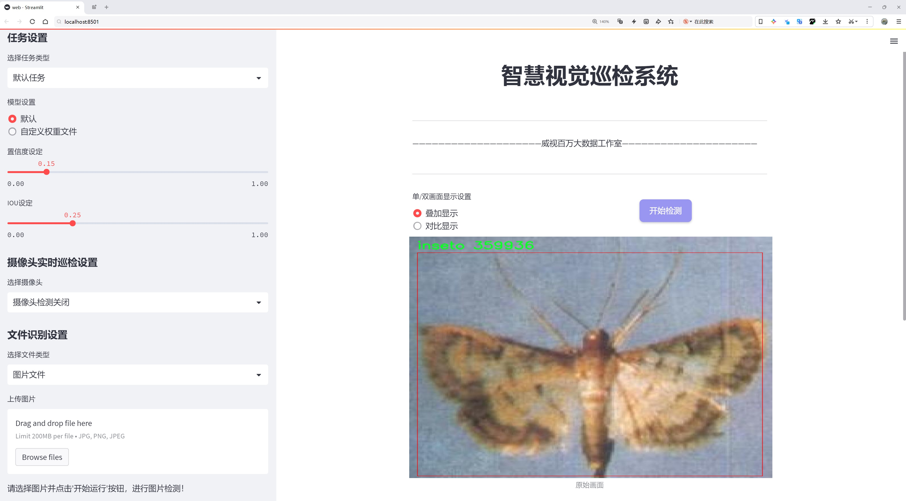
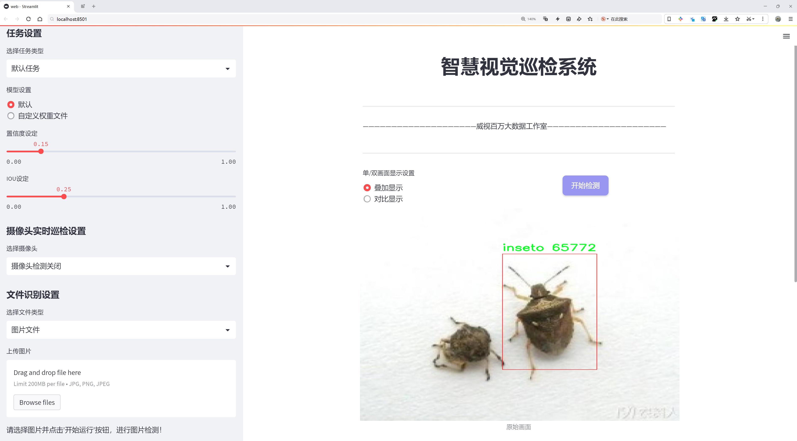
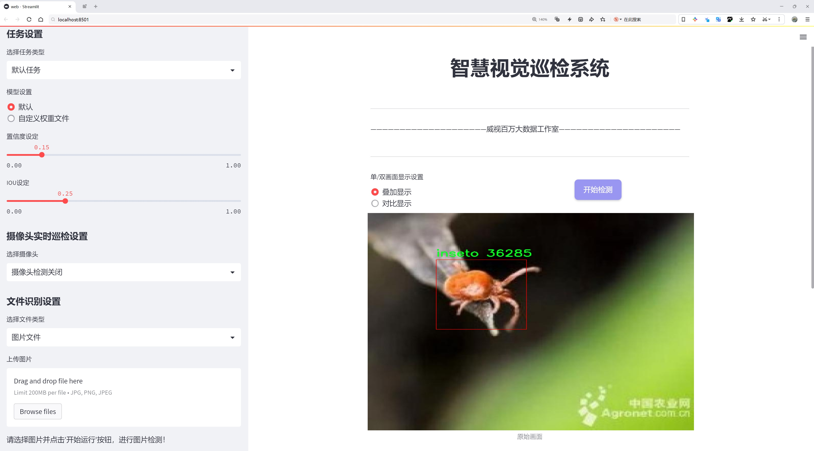
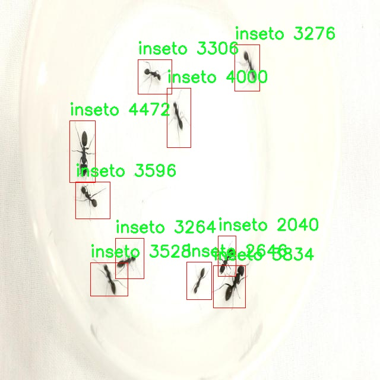
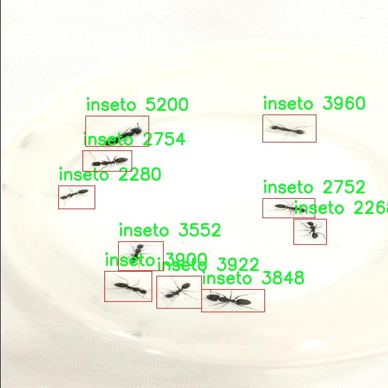
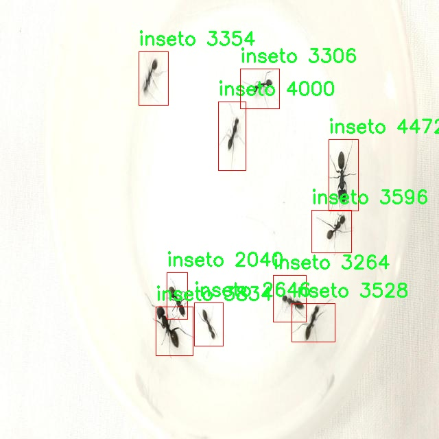
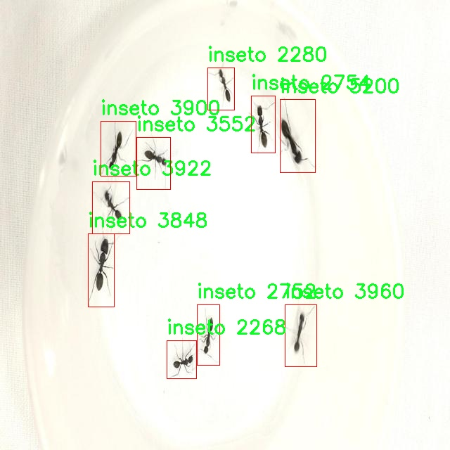

# 昆虫检测检测系统源码分享
 # [一条龙教学YOLOV8标注好的数据集一键训练_70+全套改进创新点发刊_Web前端展示]

### 1.研究背景与意义

项目参考[AAAI Association for the Advancement of Artificial Intelligence](https://gitee.com/qunshansj/projects)

项目来源[AACV Association for the Advancement of Computer Vision](https://gitee.com/qunmasj/projects)

研究背景与意义

随着全球生态环境的变化和生物多样性的减少，昆虫在生态系统中的重要性愈发凸显。昆虫不仅是食物链中的关键组成部分，还在授粉、土壤改良和有机物分解等生态服务中发挥着不可替代的作用。然而，近年来，昆虫种群的急剧减少引发了广泛的关注，科学界亟需开发有效的监测和保护手段。传统的昆虫调查方法往往依赖于人工观察和捕捉，效率低下且容易受到人为因素的影响。因此，基于计算机视觉和深度学习技术的昆虫检测系统应运而生，成为现代生态研究的重要工具。

在众多的目标检测算法中，YOLO（You Only Look Once）系列因其高效性和实时性而备受青睐。YOLOv8作为该系列的最新版本，结合了更先进的网络结构和优化算法，能够在保持高精度的同时显著提高检测速度。然而，针对特定领域的应用，尤其是昆虫检测，YOLOv8的标准模型可能并不完全适用。因此，基于YOLOv8的改进模型将是实现高效昆虫检测的关键所在。

本研究所采用的数据集“昆虫远观”包含1800幅图像，专注于单一类别的昆虫检测。尽管数据集的规模相对较小，但其针对性强，能够为模型的训练提供高质量的样本。通过对数据集的深入分析，我们可以发现，图像中的昆虫多样性、背景复杂性以及光照变化等因素都对检测精度产生了显著影响。因此，改进YOLOv8模型时，需特别关注这些因素，以提升模型在实际应用中的鲁棒性和适应性。

此外，昆虫检测系统的研究不仅具有学术价值，更具实际应用意义。通过构建高效的昆虫检测系统，研究人员能够实时监测昆虫种群变化，为生态保护和生物多样性维护提供数据支持。同时，该系统还可应用于农业、林业等领域，帮助农民和管理者识别有害昆虫和益虫，从而实现精准农业和可持续发展。

综上所述，基于改进YOLOv8的昆虫检测系统的研究，不仅能够推动计算机视觉技术在生态学领域的应用，还能为昆虫保护和生态环境监测提供重要的技术支持。通过这一研究，我们期望能够提高昆虫检测的效率和准确性，为生态学研究和环境保护贡献新的思路和方法。

### 2.图片演示







##### 注意：由于此博客编辑较早，上面“2.图片演示”和“3.视频演示”展示的系统图片或者视频可能为老版本，新版本在老版本的基础上升级如下：（实际效果以升级的新版本为准）

  （1）适配了YOLOV8的“目标检测”模型和“实例分割”模型，通过加载相应的权重（.pt）文件即可自适应加载模型。

  （2）支持“图片识别”、“视频识别”、“摄像头实时识别”三种识别模式。

  （3）支持“图片识别”、“视频识别”、“摄像头实时识别”三种识别结果保存导出，解决手动导出（容易卡顿出现爆内存）存在的问题，识别完自动保存结果并导出到tempDir中。

  （4）支持Web前端系统中的标题、背景图等自定义修改，后面提供修改教程。

  另外本项目提供训练的数据集和训练教程,暂不提供权重文件（best.pt）,需要您按照教程进行训练后实现图片演示和Web前端界面演示的效果。

### 3.视频演示

[3.1 视频演示](https://www.bilibili.com/video/BV1aat5exEhZ/)

### 4.数据集信息展示

##### 4.1 本项目数据集详细数据（类别数＆类别名）

nc: 1
names: ['inseto']


##### 4.2 本项目数据集信息介绍

数据集信息展示

在本研究中，我们使用了名为“Insects from afar”的数据集，以支持对昆虫检测系统的改进，特别是针对YOLOv8模型的训练与优化。该数据集专注于昆虫的识别与分类，旨在为昆虫生态学、农业监测以及生物多样性研究提供强有力的数据支持。数据集的设计理念是通过高质量的图像和标注，帮助研究人员和开发者更好地理解和应用计算机视觉技术于昆虫检测领域。

“Insects from afar”数据集的独特之处在于其类别设置，虽然仅包含一个类别——“inseto”，但这一类别的图像涵盖了多种昆虫的不同姿态、环境和光照条件。这种单一类别的设计使得数据集在特定任务上具有更高的聚焦性，能够有效减少模型训练过程中的复杂性。通过这种方式，研究者能够集中精力优化YOLOv8模型在昆虫检测方面的性能，尤其是在特征提取和目标定位的精度上。

数据集中的图像来源广泛，涵盖了多种生态环境下的昆虫，确保了数据的多样性和代表性。这些图像不仅包括了昆虫在自然环境中的活动状态，还包括了昆虫在不同背景下的静态图像。这种多样化的图像样本为模型提供了丰富的训练数据，使其能够更好地适应不同的实际应用场景。此外，数据集中的图像均经过精细的标注，确保每一张图像中的昆虫都被准确地框定和标识，为后续的模型训练提供了高质量的输入。

在数据集的构建过程中，研究团队采用了严格的筛选标准，确保每一张图像都符合一定的质量要求。这包括图像的清晰度、对比度以及昆虫的可见性等因素。通过这种方式，数据集不仅保证了数据的数量，更重要的是提升了数据的质量，使得训练出的模型在实际应用中能够表现出更高的鲁棒性和准确性。

此外，数据集的使用还将有助于推动昆虫检测技术的进一步发展。随着计算机视觉技术的不断进步，尤其是深度学习算法的广泛应用，昆虫检测的精度和效率将得到显著提升。这不仅对生态研究具有重要意义，也为农业生产提供了新的技术手段，帮助农民更好地监测和管理害虫，从而提高作物产量和质量。

总之，“Insects from afar”数据集为改进YOLOv8的昆虫检测系统提供了坚实的基础。通过高质量的图像和精准的标注，研究者能够有效地训练和优化模型，推动昆虫检测技术的进步。这一数据集不仅在学术研究中具有重要价值，也为实际应用提供了强有力的支持，预示着昆虫检测领域的广阔前景。










### 5.全套项目环境部署视频教程（零基础手把手教学）

[5.1 环境部署教程链接（零基础手把手教学）](https://www.ixigua.com/7404473917358506534?logTag=c807d0cbc21c0ef59de5)


[5.2 安装Python虚拟环境创建和依赖库安装视频教程链接（零基础手把手教学）](https://www.ixigua.com/7404474678003106304?logTag=1f1041108cd1f708b01a)

### 6.手把手YOLOV8训练视频教程（零基础小白有手就能学会）

[6.1 手把手YOLOV8训练视频教程（零基础小白有手就能学会）](https://www.ixigua.com/7404477157818401292?logTag=d31a2dfd1983c9668658)

### 7.70+种全套YOLOV8创新点代码加载调参视频教程（一键加载写好的改进模型的配置文件）

[7.1 70+种全套YOLOV8创新点代码加载调参视频教程（一键加载写好的改进模型的配置文件）](https://www.ixigua.com/7404478314661806627?logTag=29066f8288e3f4eea3a4)

### 8.70+种全套YOLOV8创新点原理讲解（非科班也可以轻松写刊发刊，V10版本正在科研待更新）

由于篇幅限制，每个创新点的具体原理讲解就不一一展开，具体见下列网址中的创新点对应子项目的技术原理博客网址【Blog】：


[8.1 70+种全套YOLOV8创新点原理讲解链接](https://gitee.com/qunmasj/good)

### 9.系统功能展示（检测对象为举例，实际内容以本项目数据集为准）

图9.1.系统支持检测结果表格显示

  图9.2.系统支持置信度和IOU阈值手动调节

  图9.3.系统支持自定义加载权重文件best.pt(需要你通过步骤5中训练获得)

  图9.4.系统支持摄像头实时识别

  图9.5.系统支持图片识别

  图9.6.系统支持视频识别

  图9.7.系统支持识别结果文件自动保存

  图9.8.系统支持Excel导出检测结果数据


### 10.原始YOLOV8算法原理

原始YOLOv8算法原理

YOLOv8算法是目标检测领域的一个重要里程碑，它在YOLO系列模型的基础上进行了多项创新和改进，展现出更高的性能和灵活性。作为YOLO系列的最新版本，YOLOv8不仅延续了前几代模型的优良传统，还引入了新的技术和架构设计，使其在目标检测、图像分割和图像分类等任务中表现出色。

YOLOv8的网络结构主要由三部分组成：Backbone、Neck和Head。首先，Backbone负责特征提取，采用了CSPDarknet结构，这一结构通过将网络分为两个部分并引入多个残差块，增强了特征提取的能力。相较于前代模型YOLOv5，YOLOv8用C2f模块替代了C3模块。C2f模块的设计使得输入特征图被分为两个分支，每个分支通过卷积层进行降维，同时采用v8_C2fBottleneck层替代了传统的Bottleneck层。这种结构的优势在于，分支之间的堆叠能够形成更高维度的特征图，从而为模型提供更多的梯度流信息，进而提升特征提取的效果。

在特征提取之后，YOLOv8的Neck部分采用了特征金字塔网络（FPN）和路径聚合网络（PAN）的组合结构。这一结构通过多个卷积层和池化层对特征图进行处理和压缩，确保了多尺度特征的有效融合。YOLOv8引入了快速空间金字塔池化（SPPF）结构，进一步提升了特征提取的效率，同时减少了模型的参数量和计算量，使得整体计算更加高效。

在目标检测的核心部分，YOLOv8采用了一种无锚框（Anchor-Free）的检测方式。这一方法直接预测目标的中心点及其宽高比例，避免了传统锚框方法中对预设锚框的依赖。传统的锚框方法虽然能够提高模型的精准度和召回率，但其复杂的计算和对锚框设置的依赖限制了模型的灵活性。YOLOv8通过将目标检测转化为关键点检测，简化了网络框架，提高了泛化能力，适应了不同数据集的需求。

在数据预处理方面，YOLOv8延续了YOLOv5的策略，采用了多种增强手段，如马赛克增强、混合增强、空间扰动和颜色扰动等。这些增强手段不仅丰富了训练样本，还有效提高了模型的鲁棒性，使其在不同环境下的表现更加稳定。

YOLOv8的Head部分是其设计中变化最大的部分。YOLOv5采用的耦合头（Coupled-Head）结构被解耦头（Decoupled-Head）所取代。在解耦头结构中，分类和定位任务被分为两个独立的分支，各自通过1×1卷积进行处理。这种设计使得模型在处理分类和定位任务时更加高效，减少了信息的干扰，提高了预测的准确性。

此外，YOLOv8在标签分配策略上也进行了创新。以往的候选框聚类方法在数据集不充分时容易导致聚类结果与真实物体尺寸不符，而YOLOv8采用了动态标签分配策略，解决了正负样本匹配的多尺度分配问题。通过使用Varifocal Loss和CIoULoss等损失函数，YOLOv8能够更加有效地聚焦于高质量样本，提升模型的整体性能。

综上所述，YOLOv8算法通过对Backbone、Neck和Head的多项改进，结合无锚框检测方法和动态标签分配策略，显著提升了目标检测的准确性和速度。其高效的特征提取和灵活的网络结构，使得YOLOv8在各种实际应用中都展现出了卓越的性能，成为目标检测领域的一个重要工具。随着YOLOv8的广泛应用，目标检测技术的未来将更加光明。


### 11.项目核心源码讲解（再也不用担心看不懂代码逻辑）

#### 11.1 code\ultralytics\utils\loss.py

以下是经过精简和注释的核心代码，主要集中在损失函数的实现上。这些损失函数是目标检测和分割任务中非常重要的部分。

```python
import torch
import torch.nn as nn
import torch.nn.functional as F

class VarifocalLoss(nn.Module):
    """
    Varifocal Loss 计算类，基于 Zhang 等人的论文。
    该损失函数在目标检测中用于处理类别不平衡问题。
    """

    def __init__(self):
        """初始化 VarifocalLoss 类。"""
        super().__init__()

    @staticmethod
    def forward(pred_score, gt_score, label, alpha=0.75, gamma=2.0):
        """
        计算 Varifocal Loss。
        
        参数:
        - pred_score: 预测的分数
        - gt_score: 真实的分数
        - label: 真实标签
        - alpha: 权重因子
        - gamma: 调制因子
        
        返回:
        - loss: 计算得到的损失值
        """
        weight = alpha * pred_score.sigmoid().pow(gamma) * (1 - label) + gt_score * label
        loss = (
            (F.binary_cross_entropy_with_logits(pred_score.float(), gt_score.float(), reduction="none") * weight)
            .mean(1)
            .sum()
        )
        return loss


class BboxLoss(nn.Module):
    """
    边界框损失计算类，计算目标检测中的边界框损失。
    """

    def __init__(self, reg_max, use_dfl=False):
        """初始化 BboxLoss 模块。"""
        super().__init__()
        self.reg_max = reg_max  # 最大回归值
        self.use_dfl = use_dfl  # 是否使用分布焦点损失

    def forward(self, pred_dist, pred_bboxes, anchor_points, target_bboxes, target_scores, target_scores_sum, fg_mask):
        """
        计算 IoU 损失和 DFL 损失。
        
        参数:
        - pred_dist: 预测的分布
        - pred_bboxes: 预测的边界框
        - anchor_points: 锚点
        - target_bboxes: 真实边界框
        - target_scores: 真实分数
        - target_scores_sum: 真实分数的总和
        - fg_mask: 前景掩码
        
        返回:
        - loss_iou: IoU 损失
        - loss_dfl: DFL 损失
        """
        weight = target_scores.sum(-1)[fg_mask].unsqueeze(-1)  # 计算权重
        iou = bbox_iou(pred_bboxes[fg_mask], target_bboxes[fg_mask], xywh=False, CIoU=True)  # 计算 IoU
        loss_iou = ((1.0 - iou) * weight).sum() / target_scores_sum  # IoU 损失

        # DFL 损失
        if self.use_dfl:
            target_ltrb = bbox2dist(anchor_points, target_bboxes, self.reg_max)  # 转换为目标左上右下格式
            loss_dfl = self._df_loss(pred_dist[fg_mask].view(-1, self.reg_max + 1), target_ltrb[fg_mask]) * weight
            loss_dfl = loss_dfl.sum() / target_scores_sum
        else:
            loss_dfl = torch.tensor(0.0).to(pred_dist.device)

        return loss_iou, loss_dfl

    @staticmethod
    def _df_loss(pred_dist, target):
        """
        计算分布焦点损失 (DFL)。
        
        参数:
        - pred_dist: 预测的分布
        - target: 目标分布
        
        返回:
        - DFL 损失
        """
        tl = target.long()  # 目标左边界
        tr = tl + 1  # 目标右边界
        wl = tr - target  # 左边权重
        wr = 1 - wl  # 右边权重
        return (
            F.cross_entropy(pred_dist, tl.view(-1), reduction="none").view(tl.shape) * wl
            + F.cross_entropy(pred_dist, tr.view(-1), reduction="none").view(tl.shape) * wr
        ).mean(-1, keepdim=True)


class v8DetectionLoss:
    """
    YOLO v8 检测损失计算类，综合计算边界框损失、分类损失等。
    """

    def __init__(self, model):
        """初始化 v8DetectionLoss 类。"""
        device = next(model.parameters()).device  # 获取模型设备
        h = model.args  # 超参数

        m = model.model[-1]  # Detect() 模块
        self.bce = nn.BCEWithLogitsLoss(reduction="none")  # 二元交叉熵损失
        self.hyp = h
        self.stride = m.stride  # 模型步幅
        self.nc = m.nc  # 类别数量
        self.reg_max = m.reg_max
        self.device = device

        self.use_dfl = m.reg_max > 1  # 是否使用 DFL

        self.bbox_loss = BboxLoss(m.reg_max - 1, use_dfl=self.use_dfl).to(device)  # 初始化边界框损失

    def __call__(self, preds, batch):
        """计算总损失并返回。"""
        loss = torch.zeros(3, device=self.device)  # box, cls, dfl
        feats = preds[1] if isinstance(preds, tuple) else preds  # 获取特征

        pred_distri, pred_scores = torch.cat([xi.view(feats[0].shape[0], self.nc, -1) for xi in feats], 2).split(
            (self.reg_max * 4, self.nc), 1
        )

        pred_scores = pred_scores.permute(0, 2, 1).contiguous()  # 调整维度
        pred_distri = pred_distri.permute(0, 2, 1).contiguous()

        # 目标处理
        targets = torch.cat((batch["batch_idx"].view(-1, 1), batch["cls"].view(-1, 1), batch["bboxes"]), 1)
        gt_labels, gt_bboxes = targets.split((1, 4), 2)  # cls, xyxy

        # 分类损失
        loss[1] = self.bce(pred_scores, gt_labels).sum()  # BCE 损失

        # 边界框损失
        if gt_bboxes.sum():
            loss[0], loss[2] = self.bbox_loss(
                pred_distri, pred_scores, gt_bboxes, gt_labels
            )

        return loss.sum()  # 返回总损失
```

### 代码说明
1. **VarifocalLoss**: 计算变焦损失，用于处理类别不平衡问题。
2. **BboxLoss**: 计算边界框损失，包括 IoU 损失和可选的 DFL 损失。
3. **v8DetectionLoss**: 综合计算 YOLO v8 模型的损失，包括边界框损失和分类损失。

这些核心部分构成了 YOLO 模型在训练过程中损失计算的基础，确保模型能够有效地学习目标检测任务。

这个文件是一个用于计算不同损失函数的PyTorch模块，主要用于目标检测、实例分割和关键点检测等任务。文件中定义了多个损失类，每个类实现了特定的损失计算方法，以便在训练深度学习模型时使用。

首先，`VarifocalLoss`类实现了一种变焦损失函数，主要用于处理类别不平衡问题。它通过对预测分数进行sigmoid变换，并根据目标标签的存在与否调整权重，从而计算出损失值。

接下来，`FocalLoss`类实现了焦点损失，这是一种改进的交叉熵损失，旨在关注难以分类的样本。它通过调整损失的计算方式，使得模型在训练时更加关注那些难以分类的样本。

`BboxLoss`类则用于计算边界框的损失，主要使用IoU（Intersection over Union）来评估预测边界框与真实边界框之间的重叠程度。该类还支持DFL（Distribution Focal Loss），用于进一步优化边界框的预测。

`RotatedBboxLoss`类是`BboxLoss`的扩展，专门用于处理旋转边界框的损失计算。它采用了与`BboxLoss`类似的方式，但在计算IoU时使用了旋转IoU的算法。

`KeypointLoss`类用于计算关键点的损失，主要基于预测关键点与真实关键点之间的欧几里得距离。它还考虑了关键点的可见性，以便在计算损失时只关注可见的关键点。

`v8DetectionLoss`类是一个综合性的损失类，负责计算目标检测任务中的各种损失，包括边界框损失、分类损失和DFL损失。它还包含了一些预处理步骤，以便将目标数据转换为适合模型输入的格式。

`v8SegmentationLoss`类是`v8DetectionLoss`的扩展，增加了对分割任务的支持，计算分割损失并处理掩码数据。

`v8PoseLoss`类则专注于姿态估计任务，计算关键点位置和可见性的损失，并结合了目标检测的损失计算。

`v8ClassificationLoss`类实现了简单的分类损失计算，主要用于分类任务。

最后，`v8OBBLoss`类是针对旋转边界框的目标检测任务而设计的损失类，计算与旋转边界框相关的损失。

总体来说，这个文件中的类和方法为YOLO模型的训练提供了多种损失计算的实现，支持不同的任务需求，能够有效地指导模型学习和优化。

#### 11.2 code\ultralytics\trackers\bot_sort.py

以下是经过简化和注释的核心代码部分：

```python
# 引入必要的库
from collections import deque
import numpy as np
from .basetrack import TrackState
from .byte_tracker import BYTETracker, STrack
from .utils import matching
from .utils.gmc import GMC
from .utils.kalman_filter import KalmanFilterXYWH

class BOTrack(STrack):
    """
    BOTrack类是STrack类的扩展，增加了目标跟踪功能。
    """

    # 共享的卡尔曼滤波器实例
    shared_kalman = KalmanFilterXYWH()

    def __init__(self, tlwh, score, cls, feat=None, feat_history=50):
        """初始化BOTrack实例，设置初始参数。"""
        super().__init__(tlwh, score, cls)  # 调用父类构造函数

        self.smooth_feat = None  # 平滑特征向量
        self.curr_feat = None  # 当前特征向量
        if feat is not None:
            self.update_features(feat)  # 更新特征
        self.features = deque([], maxlen=feat_history)  # 存储特征的双端队列
        self.alpha = 0.9  # 平滑因子

    def update_features(self, feat):
        """更新特征向量并使用指数移动平均进行平滑处理。"""
        feat /= np.linalg.norm(feat)  # 归一化特征
        self.curr_feat = feat  # 更新当前特征
        if self.smooth_feat is None:
            self.smooth_feat = feat  # 初始化平滑特征
        else:
            # 使用指数移动平均更新平滑特征
            self.smooth_feat = self.alpha * self.smooth_feat + (1 - self.alpha) * feat
        self.features.append(feat)  # 将特征添加到队列
        self.smooth_feat /= np.linalg.norm(self.smooth_feat)  # 归一化平滑特征

    def predict(self):
        """使用卡尔曼滤波器预测状态的均值和协方差。"""
        mean_state = self.mean.copy()  # 复制当前均值状态
        if self.state != TrackState.Tracked:
            mean_state[6] = 0  # 如果未被跟踪，设置速度为0
            mean_state[7] = 0

        # 使用卡尔曼滤波器进行预测
        self.mean, self.covariance = self.kalman_filter.predict(mean_state, self.covariance)

    @property
    def tlwh(self):
        """获取当前边界框位置，格式为(左上角x, 左上角y, 宽度, 高度)。"""
        if self.mean is None:
            return self._tlwh.copy()  # 如果均值为None，返回原始值
        ret = self.mean[:4].copy()  # 复制均值的前四个元素
        ret[:2] -= ret[2:] / 2  # 计算左上角坐标
        return ret

class BOTSORT(BYTETracker):
    """
    BOTSORT类是BYTETracker类的扩展，设计用于YOLOv8的目标跟踪。
    """

    def __init__(self, args, frame_rate=30):
        """初始化BOTSORT实例，设置跟踪参数。"""
        super().__init__(args, frame_rate)  # 调用父类构造函数
        self.proximity_thresh = args.proximity_thresh  # 空间接近阈值
        self.appearance_thresh = args.appearance_thresh  # 外观相似性阈值
        self.gmc = GMC(method=args.gmc_method)  # 初始化GMC算法实例

    def init_track(self, dets, scores, cls, img=None):
        """使用检测结果初始化跟踪。"""
        if len(dets) == 0:
            return []  # 如果没有检测结果，返回空列表
        # 创建BOTrack实例
        return [BOTrack(xyxy, s, c) for (xyxy, s, c) in zip(dets, scores, cls)]

    def get_dists(self, tracks, detections):
        """计算跟踪与检测之间的距离。"""
        dists = matching.iou_distance(tracks, detections)  # 计算IoU距离
        # 这里可以添加其他距离计算逻辑，例如ReID

        return dists  # 返回计算得到的距离

    def multi_predict(self, tracks):
        """预测多个对象的状态。"""
        BOTrack.multi_predict(tracks)  # 调用BOTrack的多目标预测方法
```

### 代码注释说明：
1. **类的定义**：`BOTrack`和`BOTSORT`类分别扩展了`STrack`和`BYTETracker`，实现了YOLOv8的目标跟踪功能。
2. **初始化方法**：构造函数中初始化了必要的属性，包括特征向量、卡尔曼滤波器等。
3. **特征更新**：`update_features`方法用于更新和平滑特征向量，确保跟踪的稳定性。
4. **状态预测**：`predict`方法使用卡尔曼滤波器来预测目标的状态，确保跟踪的准确性。
5. **距离计算**：`get_dists`方法用于计算跟踪对象与检测对象之间的距离，以便进行匹配。

这个程序文件 `bot_sort.py` 是用于实现基于 YOLOv8 的对象跟踪算法，主要包含两个类：`BOTrack` 和 `BOTSORT`。`BOTrack` 类扩展了 YOLOv8 的基础跟踪功能，增加了对象跟踪的特性，而 `BOTSORT` 类则是基于 `BYTETracker` 的扩展，设计用于支持 ReID（重识别）和 GMC（全局运动一致性）算法。

在 `BOTrack` 类中，定义了一些属性和方法来处理对象的跟踪。它使用了共享的卡尔曼滤波器 `KalmanFilterXYWH` 来预测对象的状态，并通过平滑特征向量来提高跟踪的稳定性。特征向量的更新使用了指数移动平均的方法，确保了特征的平滑性和稳定性。`BOTrack` 类还提供了方法来重新激活跟踪、更新跟踪状态，以及转换坐标格式等。

`BOTSORT` 类则是整个跟踪系统的核心，负责初始化跟踪、计算轨迹与检测之间的距离，以及进行多目标预测。它根据输入的参数设置了空间接近阈值和外观相似性阈值，以便在跟踪过程中进行更精确的匹配。如果启用了 ReID 模块，它会使用一个编码器来提取特征，并在计算距离时结合 IoU（交并比）和 ReID 特征进行综合评估。

在使用时，用户可以创建 `BOTSORT` 的实例，并通过调用 `init_track` 方法来初始化跟踪，传入检测结果、分数和类别信息。随后，可以通过 `multi_predict` 方法来进行多目标的预测和跟踪。

总的来说，这个文件实现了一个高效的对象跟踪系统，结合了 YOLOv8 的检测能力和多种跟踪算法的优点，适用于需要实时跟踪的场景。

#### 11.3 ui.py

```python
import sys
import subprocess

def run_script(script_path):
    """
    使用当前 Python 环境运行指定的脚本。

    Args:
        script_path (str): 要运行的脚本路径

    Returns:
        None
    """
    # 获取当前 Python 解释器的路径
    python_path = sys.executable

    # 构建运行命令，使用 streamlit 运行指定的脚本
    command = f'"{python_path}" -m streamlit run "{script_path}"'

    # 执行命令
    result = subprocess.run(command, shell=True)
    # 检查命令执行结果，如果返回码不为0，表示出错
    if result.returncode != 0:
        print("脚本运行出错。")


# 实例化并运行应用
if __name__ == "__main__":
    # 指定要运行的脚本路径
    script_path = "web.py"  # 这里可以直接指定脚本名称

    # 调用函数运行脚本
    run_script(script_path)
```

### 代码核心部分及注释说明：

1. **导入模块**：
   - `sys`：用于获取当前 Python 解释器的路径。
   - `subprocess`：用于执行外部命令。

2. **`run_script` 函数**：
   - **参数**：接收一个字符串类型的参数 `script_path`，表示要运行的脚本路径。
   - **获取 Python 解释器路径**：使用 `sys.executable` 获取当前 Python 解释器的完整路径。
   - **构建命令**：使用 f-string 格式化命令，构建出运行指定脚本的完整命令。
   - **执行命令**：使用 `subprocess.run` 执行构建的命令，并设置 `shell=True` 以在 shell 中运行。
   - **错误处理**：检查命令的返回码，如果不为0，表示脚本运行出错，打印错误信息。

3. **主程序块**：
   - 在 `if __name__ == "__main__":` 块中，指定要运行的脚本路径 `script_path`，并调用 `run_script` 函数来执行该脚本。

这个程序文件的主要功能是通过当前的 Python 环境来运行一个指定的脚本，具体是一个名为 `web.py` 的文件。程序首先导入了必要的模块，包括 `sys`、`os` 和 `subprocess`，以及一个自定义的路径处理模块 `abs_path`。

在 `run_script` 函数中，程序接受一个参数 `script_path`，该参数是要运行的脚本的路径。函数首先获取当前 Python 解释器的路径，这通过 `sys.executable` 实现。接着，程序构建了一个命令字符串，这个命令用于运行 `streamlit`，并指定要执行的脚本。

使用 `subprocess.run` 方法，程序执行构建好的命令。如果命令执行的返回码不为零，表示脚本运行过程中出现了错误，程序会输出一条错误信息。

在文件的最后部分，程序通过 `if __name__ == "__main__":` 语句来确保只有在直接运行该文件时才会执行后面的代码。这里指定了要运行的脚本路径为 `web.py`，并调用 `run_script` 函数来执行这个脚本。

总的来说，这个程序的作用是为用户提供一个简单的接口，以便在当前 Python 环境中运行一个特定的 Streamlit 脚本。

#### 11.4 code\ultralytics\hub\utils.py

以下是代码中最核心的部分，并附上详细的中文注释：

```python
import os
import requests
import threading
import time
from ultralytics.utils import (
    ENVIRONMENT,
    LOGGER,
    SETTINGS,
    RANK,
    ONLINE,
    __version__,
    is_git_dir,
    is_pip_package,
)

# 定义事件收集的 URL 和其他配置
class Events:
    """
    事件收集类，用于收集匿名事件分析。事件分析在设置中 sync=True 时启用，sync=False 时禁用。
    """

    url = "https://www.google-analytics.com/mp/collect?measurement_id=G-X8NCJYTQXM&api_secret=QLQrATrNSwGRFRLE-cbHJw"

    def __init__(self):
        """初始化 Events 对象，设置默认值。"""
        self.events = []  # 事件列表
        self.rate_limit = 60.0  # 事件发送的速率限制（秒）
        self.t = 0.0  # 速率限制计时器（秒）
        self.metadata = {
            "cli": Path(sys.argv[0]).name == "yolo",  # 判断是否为 yolo 命令行工具
            "install": "git" if is_git_dir() else "pip" if is_pip_package() else "other",  # 安装方式
            "python": ".".join(platform.python_version_tuple()[:2]),  # Python 版本
            "version": __version__,  # 当前版本
            "env": ENVIRONMENT,  # 环境信息
            "session_id": round(random.random() * 1e15),  # 随机生成的会话 ID
            "engagement_time_msec": 1000,  # 参与时间（毫秒）
        }
        # 根据条件判断是否启用事件收集
        self.enabled = (
            SETTINGS["sync"]
            and RANK in (-1, 0)
            and not TESTS_RUNNING
            and ONLINE
            and (is_pip_package() or is_git_dir())
        )

    def __call__(self, cfg):
        """
        尝试将新事件添加到事件列表，并在达到速率限制时发送事件。

        Args:
            cfg (IterableSimpleNamespace): 包含模式和任务信息的配置对象。
        """
        if not self.enabled:
            # 如果事件收集被禁用，则不执行任何操作
            return

        # 尝试添加事件
        if len(self.events) < 25:  # 事件列表限制为 25 个事件
            params = {
                **self.metadata,
                "task": cfg.task,  # 任务信息
                "model": cfg.model if cfg.model in GITHUB_ASSETS_NAMES else "custom",  # 模型信息
            }
            if cfg.mode == "export":
                params["format"] = cfg.format  # 导出格式
            self.events.append({"name": cfg.mode, "params": params})  # 添加事件

        # 检查速率限制
        t = time.time()
        if (t - self.t) < self.rate_limit:
            # 如果时间未超过速率限制，则等待发送
            return

        # 超过速率限制，立即发送事件
        data = {"client_id": SETTINGS["uuid"], "events": self.events}  # 客户端 ID 和事件列表

        # 发送 POST 请求
        smart_request("post", self.url, json=data, retry=0, verbose=False)

        # 重置事件列表和速率限制计时器
        self.events = []
        self.t = t

# 创建 Events 实例
events = Events()
```

### 代码核心部分说明：
1. **Events 类**：用于收集和发送匿名事件分析。初始化时设置事件列表、速率限制和元数据。
2. **__call__ 方法**：允许将事件添加到列表并在达到速率限制时发送事件。
3. **速率限制**：通过时间戳控制事件发送频率，确保不会过于频繁地发送数据。
4. **智能请求**：使用 `smart_request` 函数发送 POST 请求，将事件数据发送到指定的 URL。

这个程序文件是Ultralytics YOLO框架中的一个工具模块，主要用于处理与Ultralytics Hub的交互，包括HTTP请求、事件分析等功能。首先，文件导入了一些必要的库和模块，例如`os`、`platform`、`requests`等，并从`ultralytics.utils`中导入了一些工具函数和常量。

在文件中，定义了几个重要的常量，如`HUB_API_ROOT`和`HUB_WEB_ROOT`，它们分别表示Ultralytics Hub的API和Web地址。这些地址可以通过环境变量进行配置，若未设置则使用默认值。

接下来，定义了一个名为`request_with_credentials`的函数，该函数用于在Google Colab环境中进行带有凭证的AJAX请求。函数首先检查是否在Colab环境中运行，如果不是，则抛出一个错误。随后，它使用JavaScript在Colab中执行请求，并返回响应数据。

另一个函数`requests_with_progress`用于执行HTTP请求，并在下载时显示进度条。它根据传入的参数决定是否显示进度条，并处理请求的响应。

`smart_request`函数则是一个更复杂的请求处理函数，支持重试机制和超时设置。它可以在请求失败时自动重试，并在请求过程中显示进度条。函数内部定义了一个嵌套的`func`函数来执行实际的请求逻辑，并使用装饰器`TryExcept`来处理异常。这个函数还支持在单独的线程中执行请求，以避免阻塞主线程。

最后，定义了一个`Events`类，用于收集匿名事件分析数据。该类包含了一些属性，如事件发送的URL、速率限制、元数据等。在初始化时，它会根据特定条件决定是否启用事件收集。类的`__call__`方法用于添加新事件并在达到速率限制时发送事件数据。

文件的最后部分创建了一个`Events`类的实例，名为`events`，以便在其他地方使用该实例进行事件记录和发送。整体来看，这个模块为Ultralytics YOLO提供了与Hub交互的基础设施，支持HTTP请求、事件分析和进度显示等功能。

#### 11.5 train.py

以下是经过简化并添加详细中文注释的核心代码部分：

```python
import random
import numpy as np
import torch.nn as nn
from ultralytics.data import build_dataloader, build_yolo_dataset
from ultralytics.engine.trainer import BaseTrainer
from ultralytics.models import yolo
from ultralytics.nn.tasks import DetectionModel
from ultralytics.utils import LOGGER, RANK
from ultralytics.utils.torch_utils import de_parallel, torch_distributed_zero_first

class DetectionTrainer(BaseTrainer):
    """
    基于检测模型的训练类，继承自BaseTrainer类。
    """

    def build_dataset(self, img_path, mode="train", batch=None):
        """
        构建YOLO数据集。

        参数:
            img_path (str): 包含图像的文件夹路径。
            mode (str): 模式，可以是'train'或'val'，用户可以为每种模式自定义不同的数据增强。
            batch (int, optional): 批次大小，仅用于'rect'模式。默认为None。
        """
        gs = max(int(de_parallel(self.model).stride.max() if self.model else 0), 32)  # 获取模型的最大步幅
        return build_yolo_dataset(self.args, img_path, batch, self.data, mode=mode, rect=mode == "val", stride=gs)

    def get_dataloader(self, dataset_path, batch_size=16, rank=0, mode="train"):
        """构造并返回数据加载器。"""
        assert mode in ["train", "val"]  # 确保模式有效
        with torch_distributed_zero_first(rank):  # 在分布式环境中，确保数据集只初始化一次
            dataset = self.build_dataset(dataset_path, mode, batch_size)  # 构建数据集
        shuffle = mode == "train"  # 训练模式下打乱数据
        workers = self.args.workers if mode == "train" else self.args.workers * 2  # 设置工作线程数
        return build_dataloader(dataset, batch_size, workers, shuffle, rank)  # 返回数据加载器

    def preprocess_batch(self, batch):
        """对图像批次进行预处理，包括缩放和转换为浮点数。"""
        batch["img"] = batch["img"].to(self.device, non_blocking=True).float() / 255  # 将图像转移到设备并归一化
        if self.args.multi_scale:  # 如果启用多尺度
            imgs = batch["img"]
            sz = (
                random.randrange(self.args.imgsz * 0.5, self.args.imgsz * 1.5 + self.stride)
                // self.stride
                * self.stride
            )  # 随机选择新的图像大小
            sf = sz / max(imgs.shape[2:])  # 计算缩放因子
            if sf != 1:  # 如果需要缩放
                ns = [
                    math.ceil(x * sf / self.stride) * self.stride for x in imgs.shape[2:]
                ]  # 计算新的形状
                imgs = nn.functional.interpolate(imgs, size=ns, mode="bilinear", align_corners=False)  # 进行插值缩放
            batch["img"] = imgs  # 更新批次图像
        return batch

    def get_model(self, cfg=None, weights=None, verbose=True):
        """返回YOLO检测模型。"""
        model = DetectionModel(cfg, nc=self.data["nc"], verbose=verbose and RANK == -1)  # 创建检测模型
        if weights:
            model.load(weights)  # 加载权重
        return model

    def plot_training_samples(self, batch, ni):
        """绘制带有注释的训练样本。"""
        plot_images(
            images=batch["img"],
            batch_idx=batch["batch_idx"],
            cls=batch["cls"].squeeze(-1),
            bboxes=batch["bboxes"],
            paths=batch["im_file"],
            fname=self.save_dir / f"train_batch{ni}.jpg",
            on_plot=self.on_plot,
        )
```

### 代码核心部分说明：
1. **构建数据集**：`build_dataset` 方法负责根据输入路径和模式构建YOLO数据集，支持训练和验证模式。
2. **获取数据加载器**：`get_dataloader` 方法构造数据加载器，确保在分布式训练中只初始化一次数据集，并根据模式设置是否打乱数据。
3. **预处理批次**：`preprocess_batch` 方法对输入的图像批次进行归一化和多尺度处理，以适应不同的输入尺寸。
4. **获取模型**：`get_model` 方法创建并返回一个YOLO检测模型，并可选择性地加载预训练权重。
5. **绘制训练样本**：`plot_training_samples` 方法用于可视化训练样本及其对应的标注信息，便于调试和结果分析。

这个程序文件 `train.py` 是一个用于训练 YOLO（You Only Look Once）目标检测模型的脚本，基于 Ultralytics 的实现。程序中定义了一个名为 `DetectionTrainer` 的类，继承自 `BaseTrainer`，专门用于处理目标检测任务。

在这个类中，首先定义了一个 `build_dataset` 方法，用于构建 YOLO 数据集。该方法接收图像路径、模式（训练或验证）和批量大小作为参数，使用 `build_yolo_dataset` 函数来创建数据集，并根据模型的步幅调整数据集的处理方式。

接下来，`get_dataloader` 方法用于构建和返回数据加载器。它根据模式（训练或验证）初始化数据集，并根据是否需要打乱数据进行设置。该方法还考虑了分布式训练的情况，确保数据集只初始化一次。

`preprocess_batch` 方法负责对输入的图像批次进行预处理，包括将图像缩放到适当的大小并转换为浮点数格式。这里还实现了多尺度训练的功能，通过随机选择图像大小来增强模型的鲁棒性。

`set_model_attributes` 方法用于设置模型的属性，包括类别数量和类别名称，以便模型能够正确识别和分类目标。

`get_model` 方法返回一个 YOLO 检测模型实例，并可以选择加载预训练权重。

`get_validator` 方法返回一个用于验证模型性能的 `DetectionValidator` 实例，该实例会使用测试数据加载器进行模型评估。

`label_loss_items` 方法用于返回带有标签的训练损失项字典，方便在训练过程中跟踪损失值。

`progress_string` 方法生成一个格式化的字符串，显示训练进度，包括当前的 epoch、GPU 内存使用情况、损失值、实例数量和图像大小等信息。

`plot_training_samples` 方法用于绘制训练样本及其标注，便于可视化训练过程中的数据。

最后，`plot_metrics` 和 `plot_training_labels` 方法分别用于绘制训练过程中的指标和生成带标签的训练图，帮助用户分析模型的训练效果。

整体来看，这个文件提供了一个完整的框架，用于训练 YOLO 模型，涵盖了数据处理、模型构建、训练过程监控和结果可视化等多个方面。

#### 11.6 code\ultralytics\utils\callbacks\raytune.py

以下是代码中最核心的部分，并附上详细的中文注释：

```python
# 导入必要的库和模块
from ultralytics.utils import SETTINGS

# 尝试导入Ray和Tune库，并验证Ray Tune集成是否启用
try:
    assert SETTINGS["raytune"] is True  # 验证Ray Tune集成是否启用
    import ray
    from ray import tune
    from ray.air import session
except (ImportError, AssertionError):
    tune = None  # 如果导入失败或集成未启用，则将tune设置为None

def on_fit_epoch_end(trainer):
    """在每个训练周期结束时，将训练指标发送到Ray Tune。"""
    if ray.tune.is_session_enabled():  # 检查Ray Tune会话是否启用
        metrics = trainer.metrics  # 获取当前训练指标
        metrics["epoch"] = trainer.epoch  # 将当前周期数添加到指标中
        session.report(metrics)  # 向Ray Tune报告指标

# 定义回调函数，如果tune可用，则包含on_fit_epoch_end回调
callbacks = (
    {
        "on_fit_epoch_end": on_fit_epoch_end,  # 训练周期结束时的回调
    }
    if tune  # 如果tune可用
    else {}
)
```

### 代码核心部分解释：
1. **导入设置和库**：首先从`ultralytics.utils`导入`SETTINGS`，然后尝试导入Ray和Tune库，确保Ray Tune的集成是启用的。
2. **回调函数**：定义了一个`on_fit_epoch_end`函数，在每个训练周期结束时被调用，用于将训练指标发送到Ray Tune。
3. **指标报告**：在回调函数中，检查Ray Tune会话是否启用，如果启用，则获取当前的训练指标，并将当前周期数添加到指标中，最后通过`session.report(metrics)`将这些指标报告给Ray Tune。
4. **回调字典**：根据`tune`是否可用，构建一个包含回调函数的字典，以便在训练过程中使用。

这个程序文件是一个用于与Ray Tune集成的回调函数模块，主要用于在训练过程中将训练指标发送到Ray Tune，以便进行超参数调优。文件的开头包含了Ultralytics YOLO的版权信息和许可证声明。

首先，程序从`ultralytics.utils`模块导入了`SETTINGS`，这是一个配置字典，包含了各种设置选项。接着，程序尝试检查`SETTINGS`中是否启用了Ray Tune集成，具体是通过断言`SETTINGS["raytune"]`的值是否为`True`来验证。如果集成被启用，程序将导入Ray库及其相关模块，包括`tune`和`session`。如果导入失败或者集成未启用，`tune`将被设置为`None`，以避免后续代码出错。

接下来，定义了一个名为`on_fit_epoch_end`的函数，该函数在每个训练周期结束时被调用。函数的作用是检查Ray Tune的会话是否已启用，如果启用，则从训练器（trainer）中获取当前的训练指标，并将当前的训练周期（epoch）添加到指标中。然后，使用`session.report(metrics)`将这些指标报告给Ray Tune，以便进行监控和调优。

最后，程序定义了一个名为`callbacks`的元组，包含了一个字典，字典的键是`"on_fit_epoch_end"`，值是之前定义的`on_fit_epoch_end`函数。如果`tune`为`None`（即Ray Tune未启用），则`callbacks`将是一个空字典。这使得在训练过程中可以灵活地根据Ray Tune的启用状态来决定是否使用该回调函数。

### 12.系统整体结构（节选）

### 程序整体功能和构架概括

该程序是一个基于Ultralytics YOLO框架的目标检测系统，提供了训练、验证、损失计算、对象跟踪、回调处理等功能。整体架构围绕YOLO模型的训练和推理展开，结合了数据处理、模型构建、损失计算、跟踪算法和可视化工具，支持多种功能模块的扩展和集成。

1. **训练模块**：`train.py` 负责模型的训练过程，包括数据加载、模型初始化、损失计算和训练进度监控。
2. **损失计算**：`loss.py` 提供了多种损失函数的实现，适用于目标检测、分割和关键点检测等任务。
3. **对象跟踪**：`bot_sort.py` 实现了基于YOLO的对象跟踪算法，支持ReID和GMC。
4. **回调函数**：`raytune.py` 和 `tensorboard.py` 提供了与Ray Tune和TensorBoard的集成，支持超参数调优和训练过程可视化。
5. **工具函数**：`utils.py` 提供了与Ultralytics Hub的交互功能，包括HTTP请求和事件分析。
6. **用户界面**：`ui.py` 提供了一个简单的界面来运行特定的脚本。
7. **验证模块**：`val.py` 负责模型的验证过程，评估模型在验证集上的性能。

### 文件功能整理表

| 文件路径                                                         | 功能描述                                                                                     |
|------------------------------------------------------------------|----------------------------------------------------------------------------------------------|
| `code\ultralytics\utils\loss.py`                                 | 定义多种损失函数，用于目标检测、分割和关键点检测等任务。                                   |
| `code\ultralytics\trackers\bot_sort.py`                         | 实现基于YOLO的对象跟踪算法，支持ReID和GMC。                                                |
| `ui.py`                                                          | 提供一个简单的用户界面，用于运行特定的Streamlit脚本。                                      |
| `code\ultralytics\hub\utils.py`                                  | 提供与Ultralytics Hub的交互功能，包括HTTP请求和事件分析。                                   |
| `train.py`                                                       | 负责模型的训练过程，包括数据加载、模型初始化、损失计算和训练进度监控。                     |
| `code\ultralytics\utils\callbacks\raytune.py`                   | 实现与Ray Tune的集成，支持超参数调优和训练过程监控。                                       |
| `code\ultralytics\utils\callbacks\tensorboard.py`               | 提供与TensorBoard的集成，支持训练过程的可视化。                                            |
| `code\model.py`                                                  | 定义YOLO模型的结构和相关功能。                                                               |
| `val.py`                                                         | 负责模型的验证过程，评估模型在验证集上的性能。                                             |
| `70+种YOLOv8算法改进源码大全和调试加载训练教程（非必要）\ultralytics\nn\modules\block.py` | 定义神经网络模块的基本构建块，用于构建YOLO模型的网络结构。                                   |
| `70+种YOLOv8算法改进源码大全和调试加载训练教程（非必要）\ultralytics\utils\callbacks\raytune.py` | 与Ray Tune集成的回调函数，用于超参数调优。                                                  |
| `code\ultralytics\utils\checks.py`                               | 提供模型和数据的检查功能，确保训练和推理过程中的数据完整性和有效性。                         |
| `70+种YOLOv8算法改进源码大全和调试加载训练教程（非必要）\ultralytics\models\fastsam\val.py` | 负责FastSAM模型的验证过程，评估其在特定任务上的性能。                                       |

这个表格概述了各个文件的主要功能，帮助理解Ultralytics YOLO框架的整体结构和各个模块之间的关系。

注意：由于此博客编辑较早，上面“11.项目核心源码讲解（再也不用担心看不懂代码逻辑）”中部分代码可能会优化升级，仅供参考学习，完整“训练源码”、“Web前端界面”和“70+种创新点源码”以“13.完整训练+Web前端界面+70+种创新点源码、数据集获取”的内容为准。

### 13.完整训练+Web前端界面+70+种创新点源码、数据集获取


# [下载链接：https://mbd.pub/o/bread/ZpuWmpZu](https://mbd.pub/o/bread/ZpuWmpZu)